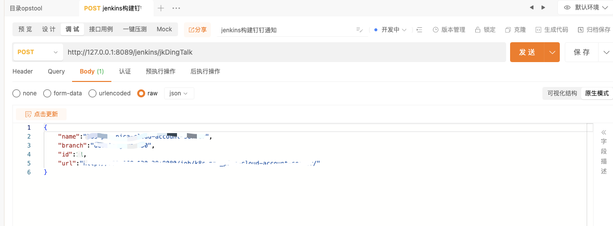
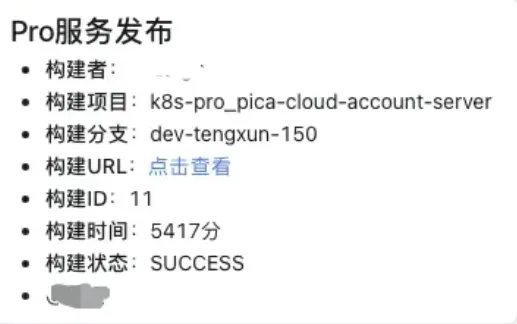

  <h1>ops_tool</h1>

<h2> ℹ️ 项目简介</h2>

架构图非常的好理解，相当于一个handler一个工具接口。

<h2> 🧰 工具目录</h2>
<ul>
  <li><a href="#jenkins构建后钉钉通知">Jenkins构建后钉钉通知</a></li>
  <li>...</li>
</ul>

<h2>统一配置</h2>

<h3>response响应参数</h3>

response是响应全部工具的配置

<pre><code>type ResponseData struct {
  Code ResCode     `json:"code"`
  Msg  interface{} `json:"msg"`
  Data interface{} `json:"data,omitempty"` // omitempty 没有值就不展示
}
</code></pre>

<h3>conf的system配置</h3>
<pre><code class="language-yaml"># 全局配置
system:
  app:
    # 设定模式(debug/release/test,正式版改为release)
    mode: debug
    host: "127.0.0.1"
    port: 8089
    # 是否初始化数据(没有初始数据时使用, 已发布正式版改为false)
    init-data: false
  log:
    level: "debug"  #debug,info,warn,error,dpanic,panic,fatal
    logPath: "./debug.log"  #"/opt/ops_tool/debug.log"
    compress: true #是否压缩处理
    maxSize: 200 #文件大小限制,单位MB
    maxBackups: 7 #文件保留天数
    maxAge: 30 #最大保留日志文件数量
  mysql:
    host: ""
    port: 3306
    user: ""
    password: ""
    dbname: "dingding"
    max_open_cons: 10
    max_idle_cons: 20
</code></pre>

<h2>工具接口：</h2>

<h3 id="jenkins构建后钉钉通知">Jenkins构建后钉钉通知</h3>

<h4>request请求参数</h4>

详细打开swagger中进行查看：http://x.x.x.x:x/swagger/index.html

<pre><code>type JenkinsDingTalkRequest struct {
  Name   string `json:"name" binding:"required"`
  Url    string `json:"url" binding:"required"`
  Id     int    `json:"id" binding:"required"`
  Branch string `json:"branch" binding:"required"`
}
</code></pre>

<h4>服务启动流程</h4>

<ul>
  <li>首先在jenkins的pipeline流水线的pipeline块加入post块</li>
</ul>

<pre><code>#!groovy
pipeline {
  agent any

  post {
    always {
      // 无论构建成功与否都不会影响整体结果
      catchError(buildResult: 'SUCCESS', stageResult: 'SUCCESS') {
        // 无论构建成功与否都执行的脚本
        sh '
          curl -X POST http://X.X.X.X:8089/jenkins/jkDingTalk \
          -H "Content-Type: application/json" \
          -d '{
            "name": "${JOB_NAME}", 
            "branch": "$branch",
            "id": "${BUILD_ID}",
            "url": "$JOB_URL"
          }'          
        '
      }
    }
  }
}
</code></pre>

<ul>
  <li>conf需要的钉钉的webhook接口，请自查询如何获取；jenkins，mysql账号密码等</li>
</ul>

<pre><code># 全局配置
system:
  app:
    # 设定模式(debug/release/test,正式版改为release)
    mode: debug
    host: "127.0.0.1"
    port: 8089
    # 是否初始化数据(没有初始数据时使用, 已发布正式版改为false)
    init-data: false
  log:
    level: "debug"  #debug,info,warn,error,dpanic,panic,fatal
    logPath: "./debug.log"  #"/opt/ops_tool/debug.log"
    compress: true #是否压缩处理
    maxSize: 200 #文件大小限制,单位MB
    maxBackups: 7 #文件保留天数
    maxAge: 30 #最大保留日志文件数量
  mysql:
    host: ""
    port: 3306
    user: ""
    password: ""
    dbname: "dingding"
    max_open_cons: 10
    max_idle_cons: 20

# jenkinsDingTalk工具配置
jenkinsDingTalk:
  jenkins:
    name: ""
    password: ""
  dingDing:
    token: ""
</code></pre>

<ul>
  <li>执行数据库sql创建数据库</li>
</ul>

<pre><code>SET NAMES utf8mb4;
SET FOREIGN_KEY_CHECKS = 0;

-- ----------------------------
-- Table structure for dingding
-- ----------------------------
DROP TABLE IF EXISTS `dingding`;
CREATE TABLE `dingding` (
  `id` int(11) NOT NULL,
  `username` varchar(255) NOT NULL,
  `name` varchar(255) DEFAULT NULL,
  `number` varchar(255) NOT NULL,
  PRIMARY KEY (`id`),
  UNIQUE KEY `id` (`id`),
  UNIQUE KEY `username` (`username`),
  UNIQUE KEY `number` (`number`)
) ENGINE=InnoDB DEFAULT CHARSET=utf8mb4;

-- ----------------------------
-- Records of dingding
-- ----------------------------
BEGIN;
INSERT INTO `dingding` (`id`, `username`, `name`, `number`) VALUES (1, 'san.zhang', '张三', '12345678910');
INSERT INTO `dingding` (`id`, `username`, `name`, `number`) VALUES (2, 'si.li', '李四', '12345678910');

COMMIT;

SET FOREIGN_KEY_CHECKS = 1;
</code></pre>

<ul>
  <li>启动程序即可，通过apipost调用结果</li>
</ul>

